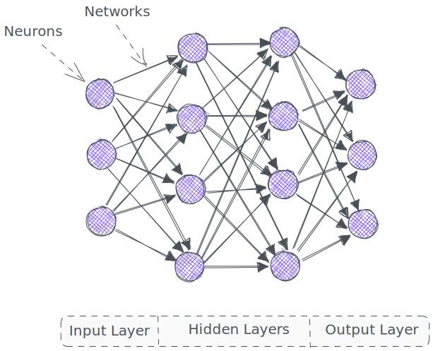

#### What are Neural Networks?
***Definition:*** A neural network is a type of machine learning algorithm modeled after the structure and function of the human brain. It consists of interconnected "neurons" that process and transmit information through weighted connections. 
***Function:*** Neural networks can learn to identify patterns and make predictions based on input data, and are commonly used for tasks such as image recognition, language translation, and stock price forecasting.



#### Input Layer
***Definition:*** The input layer does not perform any computation, but instead simply passes the input data to the next layer in the network.
***Function:*** The number of neurons in the input layer is determined by the number of features in the input data. For example, if the input data consists of images, the number of neurons in the input layer may be equal to the number of pixels in each image.

#### Hidden Layer
***Definition:*** The hidden layer is a layer in a neural network that lies between the input layer and the output layer. It is called "hidden" because its activations (outputs) are not directly observed or measured. The hidden layer performs computations on the input data and passes the results to the output layer. 
***Function:*** The hidden layer is where the majority of the network's learning occurs, as the neurons in this layer adjust their weights and biases to minimize the difference between the network's predictions and the actual output. The number of hidden layers and the number of neurons in each layer can vary depending on the architecture of the network and the complexity of the problem being solved.

#### Output layer
***Definition:*** The output layer is the last layer of a neural network and is responsible for producing the network's final predictions. The output layer takes the processed information from the hidden layer and produces a set of outputs that correspond to the desired solution for the given input data.
***Function:*** The number of neurons in the output layer is determined by the number of possible outputs or classifications. For example, in a binary classification problem, the output layer may have only one neuron, while in a multi-class classification problem, the output layer may have multiple neurons, one for each class. The activations of the neurons in the output layer can be interpreted as probabilities or scores that indicate the likelihood of each class. The final prediction is made by selecting the class with the highest score.

***Weights***: Each network is a unique weight 

***Bias***: Each neuron is a unique bias

Total tunable parameters: Weights + Bias

Training Stage: Adjust ***weights*** and ***bias*** such a way that it can actively predict when given new data

## A single neuron

![[neuron.excalidraw]]


```Python
inputs = [1.0, 2.0, 3.0]
weights = [0.2, 0.8, -0.5] #one input to one weights
bias = 2.0 #one per one neuron

output = inputs[0]*weights[0] + inputs[1]*weights[1] + inputs[2]*weights[2] + bias
print(output)
```
2.3


## An Output Layer

![[output_layer.excalidraw]]

```Python
inputs = [1, 2, 3, 2.5]
weights1 = [0.2, 0.8, -0.5, 1.0]
weights1 = [0.5, -0.91, 0.26, -0.5]
weights1 = [-0.26, -0.27, 0.17, 0.87]
bias1 = 2
bias2 = 3
bias3 = 0.5

output1 = inputs[0]*weights1[0] + inputs[1]*weights1[1] + inputs[2]*weights1[2] + bias1
output2 = inputs[0]*weights2[0] + inputs[1]*weights2[1] + inputs[2]*weights2[2] + bias2
output3 = inputs[0]*weights3[0] + inputs[1]*weights3[1] + inputs[2]*weights3[2] + bias3

output = [output1, output2, output3]
print(output)
```
[4.8, 1.21, 2.385]

